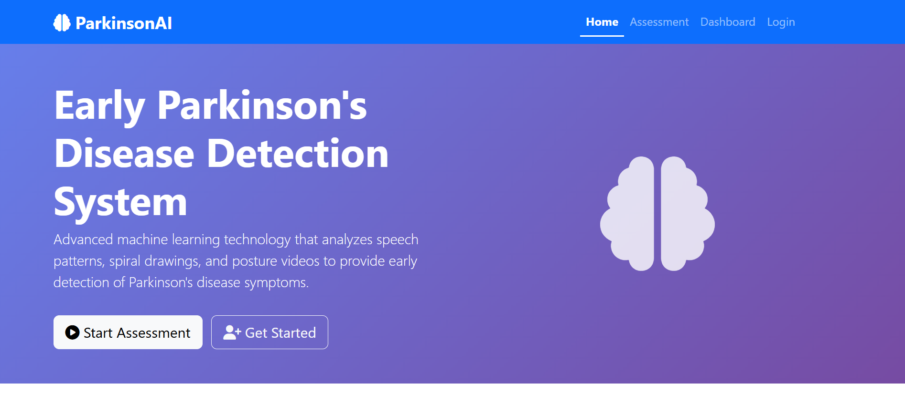
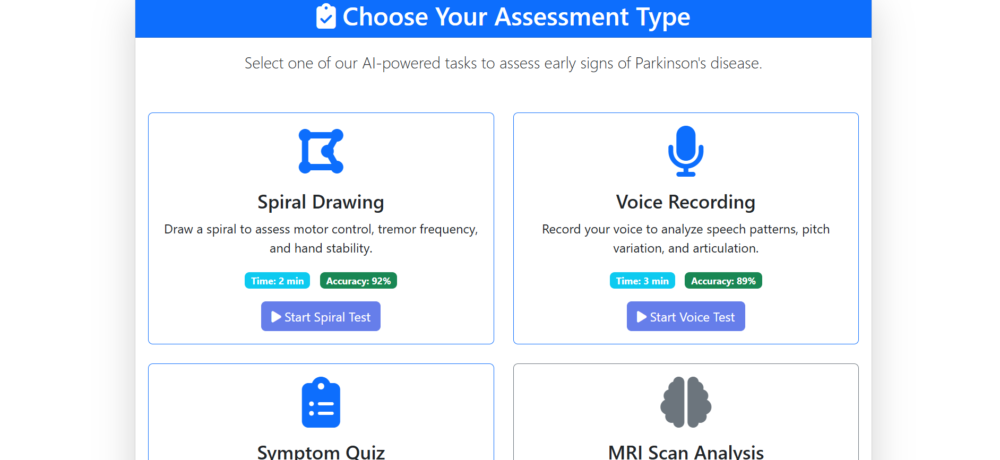
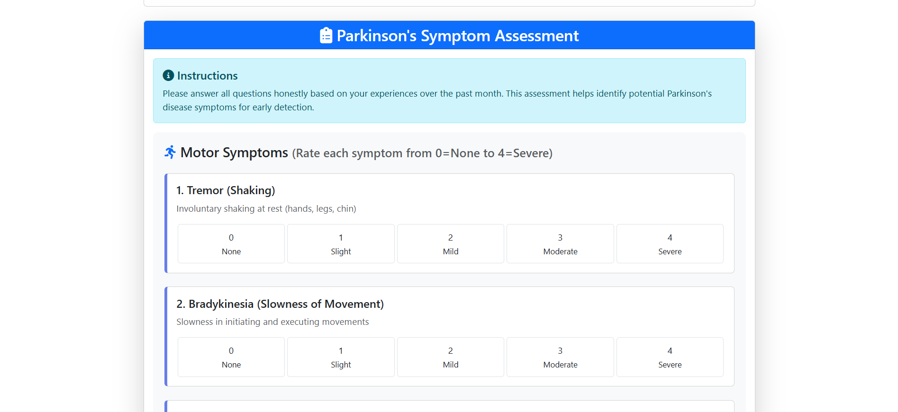
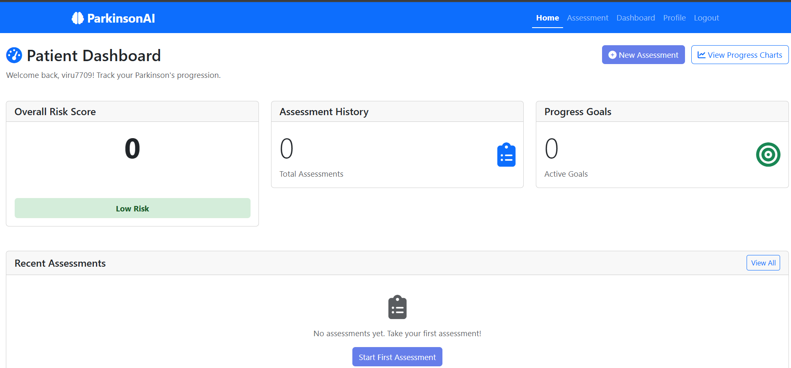
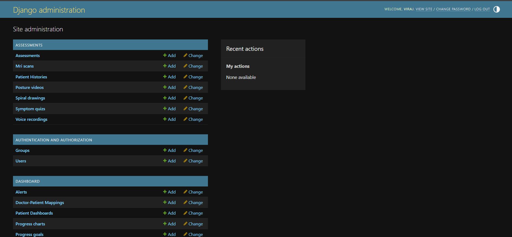
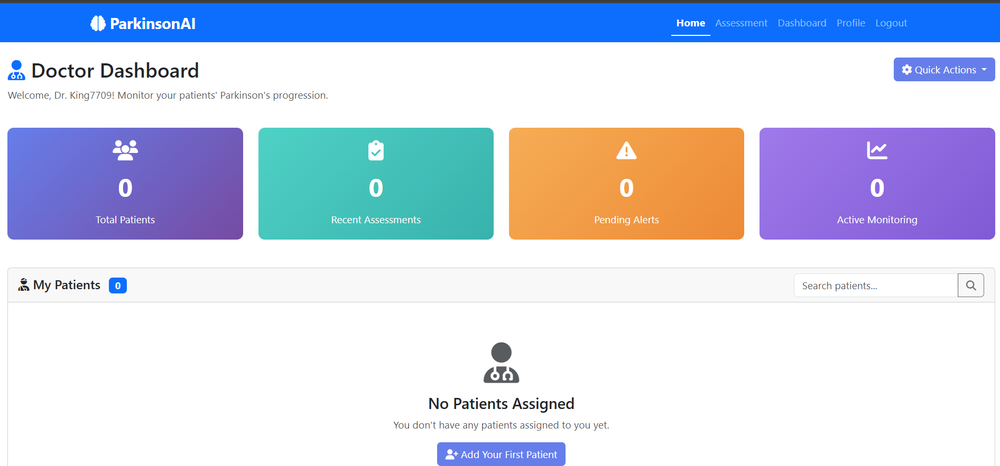

# 🧠 Parkinson Disease Prediction System (AI + Django)

A full-stack Machine Learning web application developed using Django to assist in early detection and monitoring of Parkinson Disease through patient assessment workflows and predictive analytics.

This system enables patients to perform symptom assessments, allows doctors to review results via dashboards, and supports administrators in managing the healthcare workflow.

---

## 📌 Project Objective

Parkinson Disease is a progressive neurological disorder that affects movement, speech, and cognitive functions. Early detection plays a critical role in improving treatment outcomes.

The objective of this project is to build an intelligent web-based system that:

- Collects patient assessment data
- Uses trained Machine Learning models to predict Parkinson risk
- Provides role-based dashboards for Patients, Doctors, and Admin
- Supports clinical decision-making through predictive insights

---

## 🚀 Key Features

- Parkinson Disease prediction using trained ML model
- Symptom-based patient assessment workflow
- Patient Dashboard for tracking assessments
- Doctor Dashboard for reviewing patient predictions
- Admin Panel for managing users and system flow
- Data visualization using Matplotlib
- Audio / signal processing support using Librosa
- Image processing support using OpenCV
- Clean Django-based web interface

---

## 🧠 Machine Learning Pipeline

1. Patient inputs assessment data
2. Data preprocessing using NumPy and Pandas
3. Trained ML model loaded using Joblib
4. Prediction generated (Risk / No Risk)
5. Result displayed in dashboard
6. Doctor can review patient history

---

## 🏗️ System Architecture
User → Assessment Form → Django Backend → ML Model → Prediction Result → Dashboard → Doctor Review

---

## 🖼️ Screenshots

### Home Screen

### Assessment Type

### Symptom Assessment

### Patient Dashboard

### User Profile

### Admin Panel

### Doctor Dashboard

---

## ⚙️ Technology Stack

- Python
- Django
- Scikit-Learn
- NumPy
- Pandas
- Joblib
- OpenCV
- Librosa
- Matplotlib
- Seaborn
- SQLite / PostgreSQL

---

## 📁 Project Structure
Parkinson_AI_Project/
│

├── ai_models/

├── dashboard/

├── templates/

├── static/

├── screenshots/

├── manage.py

├── requirements.txt

└── README.md

## 🛠️ Installation & Setup

### Step 1 — Clone Repository

git clone https://github.com/virajpa4/Parkinson_AI_Project.git

cd Parkinson_AI_Project

### Step 2 — Create Virtual Environment
python -m venv venv

### Step 3 — Activate Environment (Windows)
venv\Scripts\activate

### Step 4 — Install Dependencies
pip install -r requirements.txt

### Step 5 — Run Migrations
python manage.py migrate

### Step 6 — Start Server
python manage.py runserver

### Open browser:
http://127.0.0.1:8000/

---

## 🔮 Future Enhancements

- Deploy system on cloud platform
- Improve ML model accuracy with larger datasets
- Add real-time voice analysis for Parkinson detection
- Add report download & analytics dashboard
- Integrate authentication & role-based access control
- Improve UI/UX using modern frontend frameworks

---

## 👨‍💻 Author

**Viraj Patil**  
Diploma in Computer Engineering  
AI & Full-Stack Enthusiast